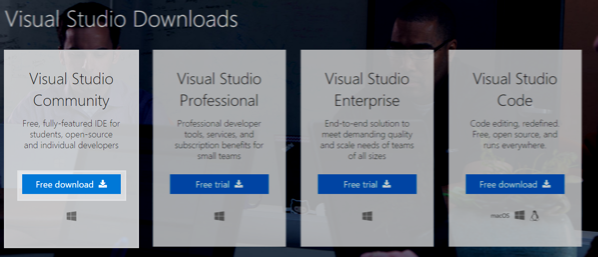
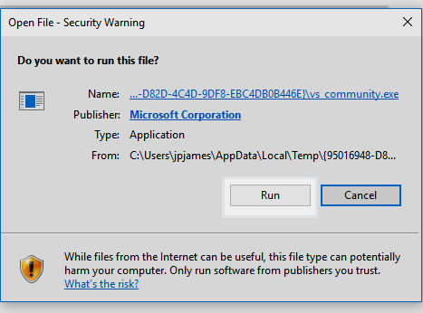
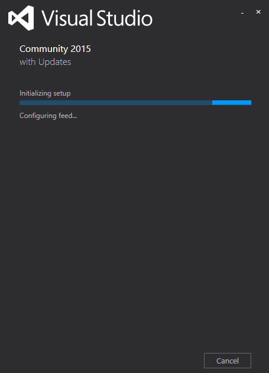
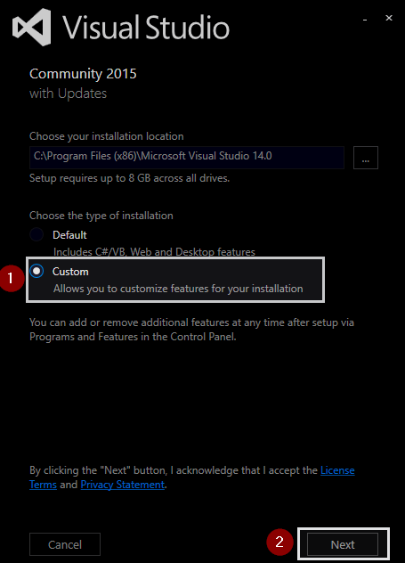
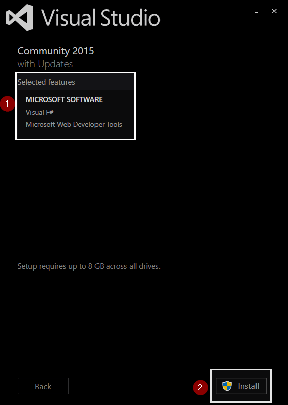
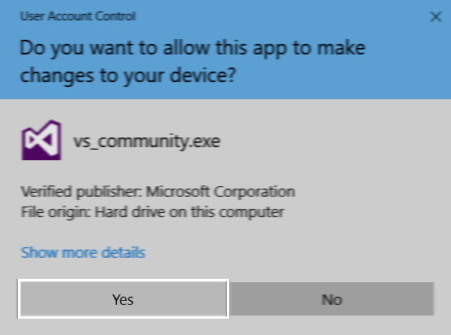
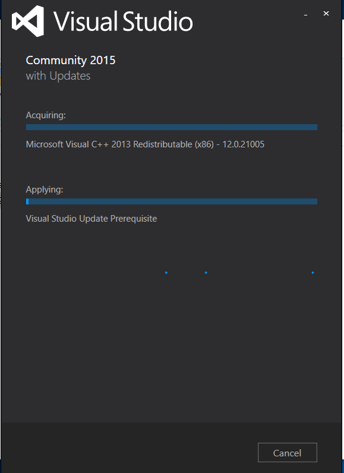

# Prerequisite Install Guide

This guide will walk you through all of the software that needs to be installed and configured in order to contribute to the allReady project.

<!-- START doctoc generated TOC please keep comment here to allow auto update -->
<!-- DON'T EDIT THIS SECTION, INSTEAD RE-RUN doctoc TO UPDATE -->
**Table of Contents**

- [General Install Steps](#general-install-steps)
  - [Windows Showing File Extensions](#windows-showing-file-extensions)
  - [Git](#git)
  - [Configuring Git](#configuring-git)
  - [Node.js](#nodejs)
  - [Proxy Settings](#proxy-settings)
    - [Windows Proxy](#windows-proxy)
    - [NPM](#npm)
  - [Updating to Npm 3](#updating-to-npm-3)
  - [Bower](#bower)
  - [Gulp](#gulp)
  - [Visual Studio](#visual-studio)
  - [Visual Studio Post Install Configuations](#visual-studio-post-install-configuations)
- [Web Solution](#web-solution)
  - [Compiling Web Solution](#compiling-web-solution)
  - [Running Web Solution](#running-web-solution)
- [Mobile Solution](#mobile-solution)
  - [Installing Mobile Tools](#installing-mobile-tools)
  - [Compiling Mobile Solution](#compiling-mobile-solution)
  - [Running in Web Browser](#running-in-web-browser)
  - [Deploying to Android Mobile Device](#deploying-to-android-mobile-device)
- [Running Test Cases](#running-test-cases)

<!-- END doctoc generated TOC please keep comment here to allow auto update -->

## General Install Steps

### Windows Showing File Extensions

By default Windows is set to not show file extensions for known files which causes files such as .gitconfig and .npmrc to show up as just a period with no file extension.  To fix this we need to turn set Windows Explorer to show file extensions.

1. Open Windows Explorer
1. Click on the View Tab and select Options

    

Once the "Folder Options" dialog is open: 

1. Click on the View Tab
1. Uncheck the "Hide extensions for known file types"
1. Click Ok

    

### Git

1. Download the latest version of [Git](http://git-scm.com/download).
1. Run the installer. 
1. Click Next 

    

1. Check all except for the last checkbox and click Next

    

1. Select the "Use Git from the Windows Command Prompt" and click Next

    

1. Select the "Checkout Windows-style, commit Unix-style line endings" and Click Next

    

1. Select the "Use MinTTY (the default terminal of MSYS2)    

    

1. Check "Enable File system caching" and "Enable Git Credential Manager" then click Install

    

1. After the install has completed run `git --version` in a command propt or command prompt to verify your install.

The last item we need to do is to setup your Git profile. In the command prompt execute the following sets of commands. 


### Configuring Git

There is a little bit of configuration that you need to do git in order for git to work correctly.

>**Note:** the --global is used in the command below to set the default configuration for all repositories.  If it is left off, you need to first clone the repository and then run the command in the allReady folder to save it as just a project configuration.

**User Name to Associate to Changes**  

```
git config --global user.name "Your Name"
```

**Email Address Associated to Github Account**

```
git config --global user.email "youremail@domain.com"
```

**Setup Long Paths (Windows Only)**

```
git config --global --add core.longpaths true
```

**Proxy Servers**

If you are behind a proxy server, you may also need to add the following configurations.

```
git config --global --add http.proxy [Your Proxy Server and Port]

git config --global --add https.proxy [Your Proxy Server and Port]

```

Not always is the git protocol allowed through firewalls.  If you encounter issue with not being able to interact with remote repository you can tell git to always use the https protocol instead.

```
git config --global --add url.https://github.com.insteadof git://github.com
```


You can validate that your configurations were saved by running:

```bash
git config --global --list
```

Your output should look similar to:

```bash
credential.helper=manager
url.https://github.com.insteadof=git://github.com
user.email=youremail@domain.com
user.name=Your Name
core.longpaths=true
https.proxy=[Your Proxy Server and Port]
http.proxy=[Your Proxy Server and Port]
```

Behind the scenes these will commands created entries in the .gitconfig file that is located in
your user profile directory.  On Windows this would be c:\users\[your idsid]. 

 The file will look similar to:

```text
[credential]
	    helper = manager
[url "https://github.com"]
	    insteadof = git://github.com
[user]
	    email = youremail@domain.com
	    name = Your Name
[core]
	    longpaths = true
[https]
	    proxy = [Your Proxy Server and Port]
[http]
	    proxy = [Your Proxy Server and Port]
```

### Node.js

1.	Download the latest stable version (LTS) of [NodeJS](https://nodejs.org/en/download/) which as of this writing is 4.6.0.

    

1.	Once you download the installer, run it and accept all defaults.
1.	When the install is completed, launch a command prompt and execute `node -v` to validate the version installed.  It should return 4.6.0 as of this writing.

### Proxy Settings

Command line shells do not use global proxy setting so these need to be set in several files. All the files to be edited or created reside in the c:\users\\[your idsid] directory.

#### Windows Proxy 

If you are on a Windows system and will use the Command window to execute Node or Bower commands you need to set your proxies at the user level.

1. In an Windows Command prompt execute the following commands to configure proxies:

```js
setx http_proxy [Your Proxy Server and Port]

setx https_proxy [Your Proxy Server and Port]
```

#### NPM

1.	In a command prompt execute the following commands to configure Node:

```js
npm config set proxy [Your Proxy Server and Port]

npm config set https-proxy [Your Proxy Server and Port]
```

### Updating to Npm 3

For Windows users, it is suggested that you install npm 3.x to avoid issues with file path lengths.  Npm 3.x is works much better on Windows than the 2.x version that comes with Node 4.x.  To upgrade Npm to the 3.x version, we are going to use the Npm package, [npm-windows-upgrade](https://www.npmjs.com/package/npm-windows-upgrade).

First, ensure that you can execute powershell scripts on your system by running the following command from an **elevated PowerShell** by clicking Start, search for PowerShell, right-click PowerShell and select Run as Administrator.

```powershell
Set-ExecutionPolicy Unrestricted -Scope CurrentUser -Force
```

Then, to install and use this upgrader tool, from an an elevated PowerShell or command prompt run: 

```bash
npm install --global --production npm-windows-upgrade
npm-windows-upgrade
```

The tool will show you a list of all the published and available versions of npm (including pre-release and beta versions). Choose the latest 3.x version that shows up, which as of writing this is 3.10.8

To validate that it installed correctly, from your Powershell or command prompt run:

```bash
npm -v
```

You are now done with the elevated Powershell and/or command prompt and can close it.  

### Bower

Open a non-administrative command prompt and execute the command:

```
npm install -g bower
```

To verify that bower was installed, run the command `bower -v`.  As of this writing the version returned was 1.7.9.

### Gulp

Open a non-administrative command prompt and execute the command:

```
npm install -g gulp-cli
```

To verify that the gulp-cli was installed, run the command `gulp -v`.  As of this writing the version returned is "CLI version 1.2.2"

### Visual Studio

allReady uses Visual Studio 2015 along with .NET Core.  This guide will be using the free Visual Studio 2015 Community Edition but any version of Visual Studio 2015 will work and the steps are the same for all versions.  

1. Download Visual Studio 2015 Community Edition from [https://www.visualstudio.com/downloads/](https://www.visualstudio.com/downloads/)

    

1. Launch the download installer
1. If the "Open File - Security Warning" dialog comes up asking if you should run the executable, click on the Run button.

    

1. This will download another file and may prompt you with the "Open File - Security Warning" dialog again.  Click the run button.

    

1. The next step will open up the Visual Studio Community 2015 installer and download the setup feed  It may take a few minutes for this to complete.

    

1. Next it will ask you for the installation location and the type of installation.  We will be using the already defined install location but we need to select the "Custom" install type and then click on Next

    

1. Ensure that Visual F# and Microsoft Web Developer Tools are checked.  Then click on next.

    

1. Confirm that F# and Microsoft Web Developer Tools are listed as the features and then click Next

    

1. If the User Access Control pops up, click the Yes button

    

1. It will take awhile for the install to complete as it has to download the different components.

    
         
### Visual Studio Post Install Configuations

* Configure External Web Tools (put PATH first)


### Installing .NET Core

### Installing ASP.NET Core Tooling


## Web Solution

### Compiling Web Solution


### Running Web Solution


## Mobile Solution

###  Installing Mobile Tools

* jdk8
* vs 2015 cordova tools
* ionic
* cordova
* gulp-cli
* bower

### Compiling Mobile Solution

* ionic state restore
* open in Visual Studio

### Running in Web Browser


### Deploying to Android Mobile Device


## Running Test Cases
